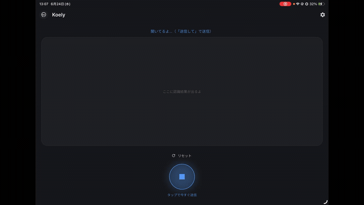

# Koely

> Hands-free voice → your messaging app, pre-filled. Speak, and your words land in a chat ready to send.
>
> 声で話しかけると、その内容がチャットアプリに入力済みで開く。あとは送信ボタンを押すだけ。

<p align="center">
  
</p>

**Koely** is a small Flutter app (iOS / Android) that turns a spoken phrase into a **pre-filled message** in Telegram — or any app, via a custom URL template. Say *"Hey Siri, open コエリー"*, speak your message, and Koely drops the text into the target chat. You just tap **send**.

It was built as a hands-free front-end for a personal Telegram-based AI-secretary bot, but it works with **any** Telegram bot or deep-link target.

---

## Why

Opening a chat app → tapping the input → tapping the mic → tapping send is too many steps when your hands are busy (walking, commuting, lying down). Koely collapses that into:

```
"Hey Siri, open コエリー"  →  speak  →  "送信して"  →  one tap to send
```

## How it works

```
"Hey Siri, open コエリー"
   └─ app comes to front and auto-starts the mic
        └─ you speak (continuous dictation, no time limit)
             └─ say "送信して" (or your custom trigger word)
                  └─ countdown (3s default) → Koely opens the target chat with your text pre-filled
                       └─ you tap send  →  the chat app delivers it
```

The agent that actually *does* things (e.g. a Telegram bot wired to an LLM) lives wherever you host it. Koely is purely the **voice front-end** — it never needs to reach your backend directly, because the chat app's own cloud relays the message for you.

## Features

- **Hands-free launch** via *"Hey Siri, open コエリー"* (iOS) or *"Hey Google, open コエリー"* (Android); auto-starts listening on foreground.
- **Speak → pre-filled message** in the target chat (one tap to send).
- **Voice send trigger:** say a configurable word (default 「送信して」) at the end and a short countdown fires, then it opens the chat — fully hands-free. Keep talking and the countdown resets.
- **Voice reset:** say a configurable word (default 「リセット」) to clear the transcript and start over — no need to touch the screen.
- **Continuous dictation:** keeps listening through phrase pauses; finalized words are locked in so the transcript never rolls back.
- **Providers:** Telegram (bot username) or a **Custom URL template** with a `{text}` placeholder → works with LINE, WhatsApp, SMS, and more.
- **System / Light / Dark** themes with a custom sliding toggle; adaptive app icon (light/dark).
- A small, **portable design system** (`lib/theme.dart`) so the same look drops into future apps.

## Providers

| Provider | How | Pre-fill |
|---|---|---|
| **Telegram** | bot username → `tg://resolve?domain=…&text=…` | ✅ |
| **Custom URL** | `{text}` template, e.g. `https://wa.me/<number>?text={text}`, `https://line.me/R/oaMessage/@id/?{text}`, `sms:?body={text}` | ✅ |

> Discord / Slack are **not** supported: they have no deep link that pre-fills a message to a specific chat. The Custom template covers everything that does.

## Design decisions (the interesting part)

- **Why route through the chat app instead of calling the bot's API directly?**
  The agent (and, in the original use case, a *local* LLM) runs on a home machine. Telegram's cloud already relays messages to it, so going through Telegram means **zero networking setup on the phone** — no tunnel, no VPN, no exposed port. A direct-API approach would require exposing the home machine to the internet.

- **Why does one tap remain?**
  Telegram (and the others) deliberately block third-party apps from sending a message *as you* without a tap — anti-spam. So Koely pre-fills and **you** confirm. Fully automatic would require an account-level userbot, which is heavy and against the spirit.

- **Why Telegram + a generic Custom template, instead of per-app integrations?**
  A `{text}` URL template covers any app that exposes a prefill deep link (LINE, WhatsApp, SMS, Signal…) with **zero extra code** — far more maintainable for an OSS tool than hardcoding each provider.

- **Why a spoken trigger word instead of silence-based send?**
  Android's `SpeechRecognizer` finalizes on its own ~2s silence, largely ignoring longer pause settings — so a "send after N seconds of silence" fires unpredictably. Koely instead **sends on a spoken trigger word** and re-arms the recognizer across cutoffs to keep one continuous transcript. On iOS, Apple's `SFSpeechRecognizer` handles continuous dictation far more gracefully, but the trigger-word pattern works well on both platforms.

- **Design system.**
  Colors, radii, and typography live in `lib/theme.dart` as portable tokens, so the visual language is reusable across apps. Latin text uses **Inter**; Japanese falls back to **Noto Sans JP** (Inter ships no Japanese glyphs).

## Build & run

Requires [Flutter](https://flutter.dev).

### iOS (recommended)

```bash
flutter pub get
flutter run          # with device connected
# or: flutter build ios --release
```

> Free Apple ID signing works (Settings → Signing & Capabilities → Personal Team). The device must trust the developer profile once after install.

### Android

```bash
flutter pub get
flutter build apk --release
# install build/app/outputs/flutter-apk/app-release.apk
```

> If your system JDK is too new for the bundled Gradle, point the project at JDK 17 in `android/gradle.properties`:
> `org.gradle.java.home=/path/to/jdk-17`

## Configure

1. Open Koely → **⚙ settings**.
2. Pick a **provider**:
   - **Telegram** — enter your bot's username (without `@`).
   - **Custom** — enter a URL template containing `{text}`.
3. Set the **send trigger word** (default 「送信して」), **reset trigger word** (default 「リセット」), and **countdown seconds** (2–8s).
4. Optionally toggle auto-listen and pick a theme.

## Limitations

- The one send tap is **by design** (anti-spam in the chat apps).
- iOS distribution requires Apple Developer Program ($99/yr) for TestFlight / App Store; free signing is limited to your own device with a 7-day re-sign cycle.

## License

[MIT](./LICENSE)
